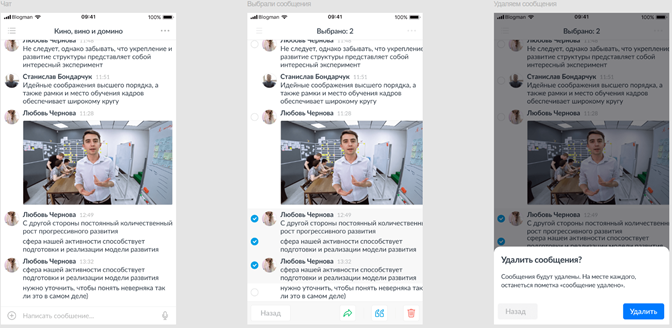
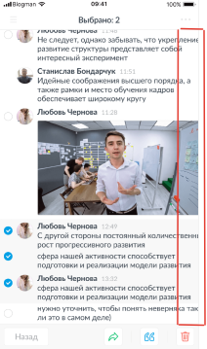

# test-1
В нашем приложении при общении в чате можно выбрать несколько сообщений, чтобы совершить с ними типовые действия, такие как «Переслать», «Цитировать» и «Удалить». На скриншотах представлен реализованный функционал выбора и удаления сообщения.

Задача:
Пожалуйста, опишите ошибки, которые вы видите.

Ответ:

| ID | Заголовок | Приоритет | Шаги воспроизведения | Ожидаемый результат | Фактический результат | Доп. материалы | 
| ------------- | ------------- | ------------- | ------------- | ------------- | ------------- | ------------- |
| 1 | Ошибка в тексте | Trivial  | 1. Запустить приложение.   2. Открыть любой чат, например, "Кино, вино и домино". | Текст указан без ошибки: "Написать сообщение...". | Текст указан с ошибкой: "Написать сообшение...". |  |
| 2 | Непральная сортировка сообщений по времени отправки | Major | 1. Запустить приложение.   2. Открыть любой чат, например, "Кино, вино и домино".   3. Посмотреть на порядок и время сообщений. | Сообщения сортируются по времени отправления. | Сообщения сортируются произвольно и не имеют четкого порядка. |  |
| 3 | Функция "Выбрать" работает не для каждого сообщения |Major|1. Запустить приложение. 2. Открыть чат "Кино, вино и домино". 3. Выбрать одно или несколько сообщений. 4. Найти сообщение Станислава Бондарчука от 11:51.|Функция "выбрать" присутствует у каждого сообщения.|Функция "выбрать" присутствует у каждого сообщения.Функция "выбрать" присутствует не для всех сообщений.||
|4|Счетник выбранных сообщений работает некорректно|Major|1. Запустить приложение. 2. Открыть любой чат, например, "Кино, вино и домино". 3. Выбрать несколько сообщений. 4. Посмотреть на кол-во выбранных сообщений, считаемых счетчиком приложения.|Счетчик считает каждое выбранное сообщение.|Счетчик считает не все выбранные сообщения.| |
|5|Ошибка в тексте|Trivial|1. Запустить приложение. 2. Открыть любой чат, например, "Кино, вино и домино". 3. Выбрать несколько сообщений. 4. Нажать на иконку корзины ("удалить").|Текст указан без ошибки: "Сообщения будут удалены. На месте каждого останется пометка «сообщение удалено».".|Текст указан с ошибкой: "Сообщения будут удалены. На месте каждого, останеться пометка «сообщение удалено».".||
|6|Блок с сообщениями уходит за видимую область экрана|Minor|1. Запустить приложение. 2. Открыть любой чат, например, "Кино, вино и домино". 3. Выбрать одно или несколько сообщений.|На экране отображается кнопка выбора для каждого сообщения, при этом сообщения подстраиваются под разрешение устройства и не уходят из зоны видимости (например изменение размера).|На экране отображается кнопка выбора для каждого сообщения, при этом часть сообщения уходит из зоны видимости.||