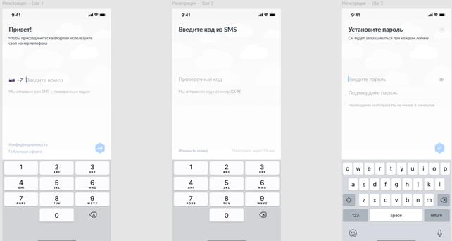

# test-2
В приложении пользователь регистрируется по своему номеру телефона и после этого опционально может установить пароль для усиления защиты.

Задача:
Пожалуйста, расскажите, как бы вы составили чек-лист (список проверок) для данного экрана.

Ответ:

1) Проверить на орфографию и пунктуацию.
2) Проверить кликабельность кнопки "Конфиденциальность": наличие и актуальность.

3) Проверить кликабельность кнопки "Публичная оферта": наличие и актуальность. 

4) Проверить неактивность кнопки далее (стрелка) с пустым полем номера телефона.
5) Проверить на ввод 10 цифр номера телефона: по окончании ввода кнопка далее (стрелка) должна быть активна.
6) Проверить на ввод от 1 до 9 цифр номера телефона: при каждой введенной цифре кнопка далее (стрелка) не должна быть активна.
7) Проверить на невозможность ввода более 10 цифр.
8) Проверить кликабельность кнопки «Изменить номер».
9) Проверить кликабельность кнопки «Повторить» через 60 секунд после отправки кода.
10) Проверить валидный код.
11) Проверить не валидный код: информация об ошибке.
12) Проверить кликабельность кнопки «закрыть окно».
13) Проверить неактивность кнопки подтверждения (галочка) с пустым полем «введите пароль» и/или «подтвердите пароль».
14) Проверить на ввод валидного пароля: не меньше 8 символов (буквы, цифры, специальные символы - все вместе)*.
15) Проверить на ввод не валидного пароля.
16) Проверить, что вводимый пароль скрывается астерисками.
17) Проверить кликабельность иконки отображения пароля (глазочек).
18) Проверить 2 инпута с одинаковым паролем: если пароль введен в оба инпута одинаковый, то кнопка подтверждения (галочка) активна; если пароль в оба инпута различается, то кнопка подтверждения (галочка) не активна и/или появляется ошибка.

*Так как в условиях задания не было указано требования к паролям, то я проверила базовые случаи из чего может состоять пароль.
