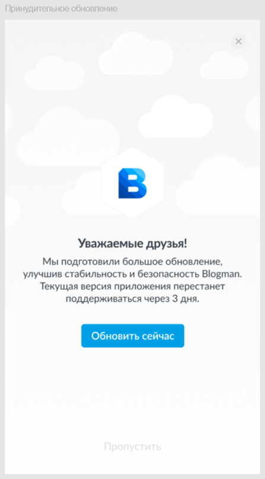

# test-5
Внутри приложения иногда происходят большие обновления. Например, когда случилось значимое изменение в API или функционале. В такой ситуации нужно деликатно сказать всем пользователям, чтобы они обновили приложение, потому что старая версия скоро перестанет работать.

Дизайнер подготовил макет, который показывает все состояния приложения в этой ситуации.

Задача:
Представьте ситуацию, что менеджер продукта не составил для этого экрана техническое задание и попросил вас ему помочь. Пожалуйста, расскажите, каким техническим заданием вы бы сопроводили макет, передавая его разработчикам.

Ответ:

Отсчет 3 дней начинается с момента отправки модального окна пользователям. Оно должно появляться всегда, когда пользователь входит в приложение. Кнопка "Обновить сейчас" должна быть кликабельной с момента отправки модального окна и до момента пока пользователь не обновит приложение. При нажатии на кнопку "Обновить сейчас" пользователя перенаправляет на страницу приложения в Google Play/App Store. В течение этого времени пользователь еще может не обновлять приложение, поэтому кнопки "Пропустить" и "Закрыть окно" должны быть кликабельны. При нажатии на кнопки "Пропустить" или "Закрыть окно" пользователь переходит на главную страницу приложения. По истечении 3 дней кнопки "Пропустить" и "Закрыть окно" должны стать неактивны или отсутствовать в модальном окне; кликабельной остается только кнопка "Обновить сейчас".