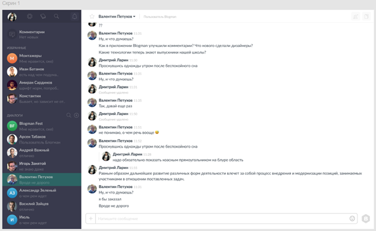
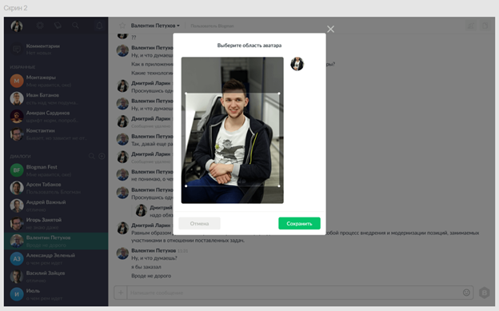
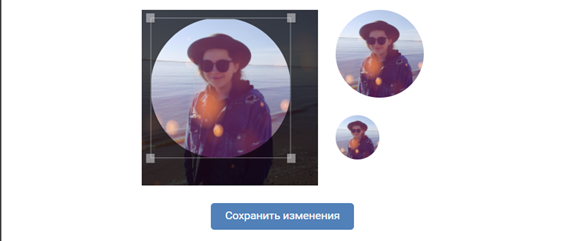
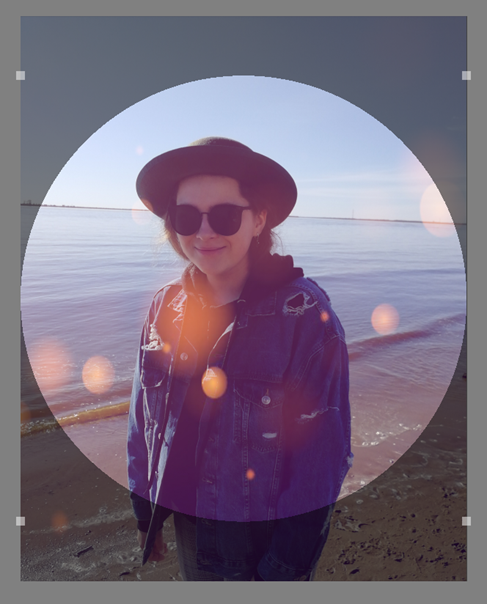
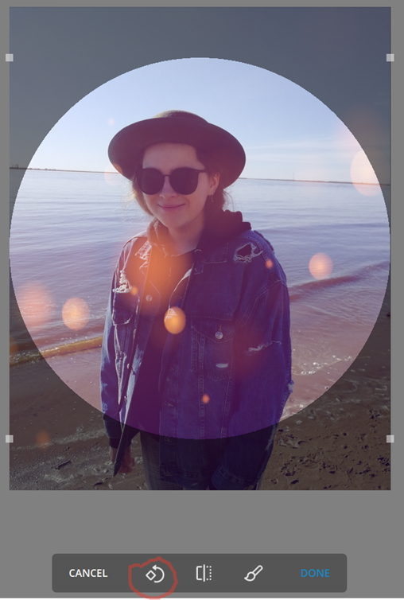
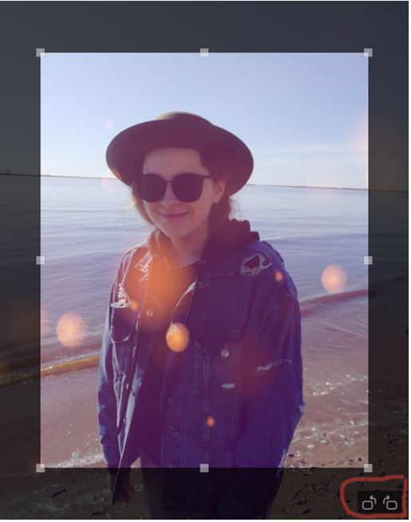
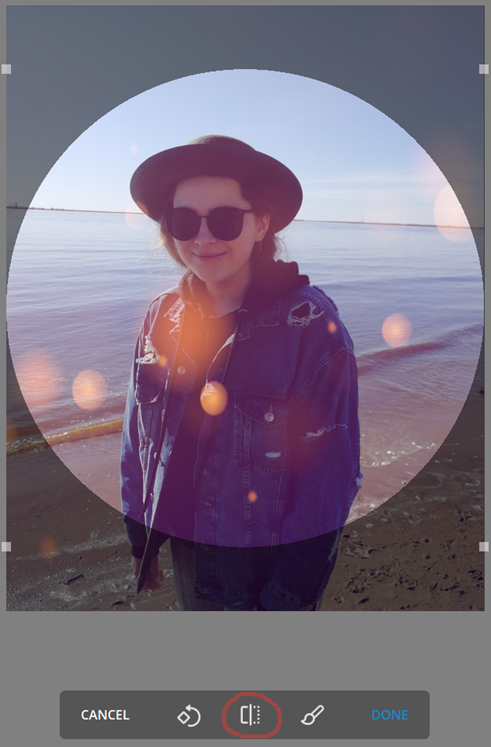

# test-6
В мессенджерах у пользователей есть аватарки. На скрине 1 представлено, как выглядят аватарки в нашем приложении.

На скрине 2 дизайнер подготовил экран, который пользователь видит после загрузки своего аватара.

Задача:
Пожалуйста, дайте дизайнеру (скрин 2) комментарии и предложения.

Ответ:

1) Я предлагаю изменить crop: область выделения аватара на круглый, но для удобства ограничить квадратом. Пример:

2) Добавить функцию переворота фото. Пример:

3) Добавить функцию отразить фото зеркально по горизонтали (Но данное предложение я бы обсудила с командой, т.к. перегружать функционал тоже не есть хорошо). Пример:

