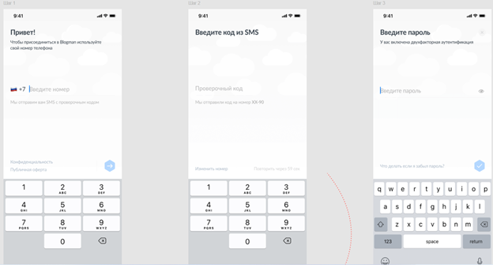
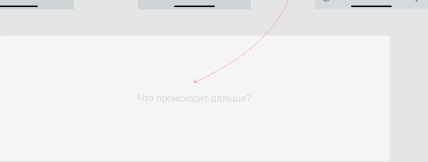

# test-7
Вы — сотрудник небольшой IT-компании. Для общения по рабочим вопросам в компании используется приложение — некий корпоративный мессенджер.

Для того, чтобы войти в приложение, нужно ввести свой номер телефона, а затем ввести код, полученный из СМС. В качестве двухфакторной аутентификации для усиления безопасности в приложении необходимо задать пароль, который нужно ввести после того, как был введен код из СМС.

Представьте ситуацию, что вы поменяли смартфон, и теперь вам нужно залогиниться в мессенджере на новом устройстве. Проблема заключается в том, что у вас была подключена двухфакторная аутентификация, но вы забыли свой пароль и теперь без него не можете войти в приложение.

Задача:
Пожалуйста, продумайте систему безопасного сброса пароля для этого мессенджера.

Дополнительно:
Внутри мессенджера при подключении двухфакторной аутентификации не используются email, google authenticator и какие-либо другие сторонние решения.

Ответ:

Если пользователю не приходит SMS с кодом подтверждения, для входа он может использовать один из резервных кодов. Тогда появится модальное окно «Введите один из ваших резервных кодов».
Если все-таки рассматривать двухфакторную аутентификацию, то есть несколько вариантов безопасного восстановления пароля, но только после ввода кода подтверждения. При нажатии на кнопку «Что делать, если я забыл пароль?» пользователя перенаправляет на модальное окно…

1) «Войти с помощью резервного кода» с названием инпута «Введите один из ваших резервных кодов».

2) «подтвердите вход на другом устройстве». На старом устройстве в модальном окне появится «Обнаружено новое устройство, подтвердите вход». После подтверждения входа на новом устройстве появляется модальное окно «Придумайте новый пароль».

3) с названием инпута «Введите ответ на подсказку к паролю», далее пользователя перенаправляет на модальное окно с вводом нового пароля. Такой вариант возможен только если при создании пароля у пользователя была возможность создать подсказку, и он ей воспользовался, то она может быть выслана в SMS или появится под полем ввода пароля после внесения неправильной записи.

4) с подтверждением биометрических данных, например, распознавание лица при использовании Face Id или Samsung Pass. С успешным подтверждением появляется новое модальное окно с сообщением «Придумайте новый пароль». В противном случае пользователю придется обратиться в технический отдел.
